# 1. 初始JavaScript
## 1.1 JavaScript是什么
- JavaScript是世界上最流行的语言之一，是一种运行在客户端的脚本语言（Script是脚本的意思）
- 脚本语言：不需要编译，运行过程中由js解释器（js引擎）逐行来进行解释并执行。
- 现在也可以基于Node.js技术进行服务器端编程。

## 1.2 JavaScript的作用
- 表单动态校验（密码强度检测） js产生的最初目的
- 网页特效
- 服务端开发（Node.js)
- 桌面程序（Electron)
- App(Cordova)
- 控制硬件-物联网（Ruff)
- 游戏开发（cocos2d-js)


## 1.3 HTML/CSS/JS的关系

### HTML/CSS标记语言--描述类语言
- HTML决定网页结构和内容（决定看到什么），相当于人的身体。
- CSS决定网页呈现给用户的模样，相当于给人穿衣服，化妆。

### JS脚本语言--编程类语言
- 实现业务逻辑和页面控制（决定功能），相当于人的各种动作。

## 1.4 浏览器执行JS简介
浏览器分成两部分，渲染引擎和JS引擎
- 渲染引擎: 用来解析HTML与CSS，俗称内核，比如chrome浏览器的blink,老版本的webkit.
- JS引擎: 也称为JS解释器，用来读取网页中的JavaScript代码，对其处理后运行，比如chrome的V8     

浏览器本身并不会执行JS代码，而是通过内置JavaScript引擎（解释器）来执行JS代码。JS引擎执行代码时逐行解释每一句源码（转换为机器语言），然后由计算机去执行，所以JavaScript语言归为脚本语言，会逐行解释执行。


## 1.5 JS组成   
javaScript由三部分组成   
- ECMAScript(JavaScript语法)
- DOM（页面文档对象模型:是w3c组织推荐的处理可扩展标记语言的标准编程接口，通过DOM提供的接口可以对页面上的各种元素进行操作，例如大小，位置，颜色等）
- BOM浏览器对象模型（是指浏览器对象模型，它提供了独立于内容的，可以与浏览器窗口进行互动的对象结构，通过BOM可以操作浏览器窗口，比如弹出框，控制浏览器跳转，获取分辨率。）

## 1.6 JS初体验       
js有3种书写位置，分别为行内，内嵌和外部。                   
- 行内     
1. 可以将单行或少量JS代码写在HTML标签的事件属性中（以on开头的属性）,如：onclick
2. 注意单双引号的使用：在HTML中我们推荐使用双引号，JS中推荐使用双引号，JS中推荐我们使用单引号。
3. 可读性差，在html中编写JS大量代码时，不方便阅读。
4. 引号易错，引号多层嵌套匹配时，非常容易弄混；
5. 特殊清楚下使用。

```js
<body>
   <input type="button" value="你好" onclick="alert('hello')">
</body>
```

- 内嵌
1. 可以将多行JS代码写到\<script\>标签中。
2. 内嵌JS是学习时常用的方式。
```js
    <script>
        alert('沙漠')
    </script>
```

- 外部引入
1. 利用HTML页面代码结构化，把大段JS代码独立到HTML页面之外，既美观，也方便文件级别的服用
2. 引用外部JS文件的script标签中间不可以写代码
3. 适合js代码量比较大的情况。
```js
   <scrip src="my.js"> </scrip>
```

# 2. 注释
## 2.1 单行注释
 // 1.单行注释

## 2.2 多行注释
/* 注释内容 */


# 3. JavaScript输入输出语句   
为了方便信息的输入输出，JS中提供了一些输入输出语句，常用如下：

| 方法  |   说明   | 归属  |
| :----|  :-----|   :----|
|alert(msg)| 浏览器弹出警示框 | 浏览器 |
|console.log(msg) | 浏览器控制台打印输出信息  |  浏览器  |
| prompt(info)| 浏览器弹出输入框，用户可以输入 |  浏览器  | 


- alert(弹出警示框)
```js
    <script>
    alert('结果是')
    // prompt("请输入你的年龄");
    </script>
```
结果示例
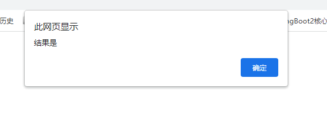


- console.log(输出到控制台)
```JS
   console.log('程序员');
```
运行结果


- prompt    
```js
    <script>
    prompt("请输入你的年龄");
    </script>
```
运行结果：
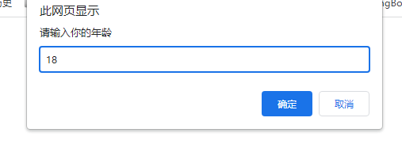


# 4. 变量概述
## 4.1 什么是变量
变量就是一个装东西的盒子，说白了，就是用于存放数据的容器，我们可以通过变量名来获取数据。

## 4.2 变量
本质: 变量是程序在内存中申请的一块用来存放数据的空间。

### 4.2.1 变量的使用
变量在使用时分为两步： 1.声明变量    2. 赋值

#### 1. 声明变量
```JS
//声明变量
var age;
```

- var是一个JS关键字，用来声明变量（variable变量的意思）。使用该关键字声明变量后，计算机会自动为变量分配内存空间，不需要程序员管。
- age是程序员定义的变量名，我们要通过变量名来访问内存中分配的空间。

示例：
```JS
    <script>
     var a="你好";
     alert(a + " hello");
//下面方法也可以
     var a;
     a=18
     alert(a)
    </script>
```

   

- 变量使用
  创建表格，表中内容为：姓名、年龄，邮箱，家庭住址和工资，存储后显示内容。
  我叫张三，火影村，30岁，邮箱123qq.com,工资为1000。


1. 弹出输入框，提示用户输入姓名
2. 弹出对话框，输出用户刚刚输入的姓名
```js
    <script>
     var userName=prompt("输入您的姓名");
     alert("请核对您的姓名：" + userName);
    </script>
```

#### 2. 变量语法扩展
1. 更新变量   
   一个变量被重新赋值后，它原有的值就会被覆盖，变量值将以最后一次赋的值为准

注意：
- 如果只声明变量，而不赋值，那么打印结果是undefined。
- 如果变量不声明，直接使用那么就会报错

2. 变量命名规范


### 4.2.2 数据类型简介
#### 1. 为什么需要数据类型
在计算机中，不同的数据所需占用的存储空间是不同的，为了便于把数据分成所需内存大熊啊不同的数据，充分利用存储空间，于是定义了不同的数据类型。    
- 简单来说,数据类型就是数据的类别型号，比如姓名"张三",年龄18.   


变量是用来存储值的所在地，它们有名字和数据类型，变量的数据类型决定了如何将代表这些值的位存储到计算机的内存中。JavaScript是一种弱类型或者说动态语言，这意味不用提前声明变量的类型，在程序运行过程中，类型会被自动确定。


#### 2. 数据类型的分类
js把数据类型分为两类:
- 简单数据类型（Number,String,Boolean,Undefined,Null)
- 复杂数据类型（object) 

##### 2.1 简单数据类型（基本数据类型）
JavaScript的简单数据类型及其说明如下：

| 简单数据类型  | 说明    |    默认值  | 
| :-----   | :-------- | :-----------|
| Number   | 数字型，包含整型值和浮点型值，如21，0.21 | 0 |
| Boolean  | 布尔型，如true,false 等价于1和0  | false  |
| String   | 字符串类型，如"张三",注意在js中，字符串都带引号 | "" |
| Undefined| var a; 声明变量a,但是没有给值，此时a = undefined | undefined | 
| Null    | var a = null，声明了变量a为空值 | null   | 

1. 数字类型
最常见的进制有二进制，八进制，十进制，十六进制。
```JS
    <script>
    //  var userName=prompt("输入您的姓名");
    //  alert("请核对您的姓名：" + userName);

    //数字测试,八进制的范围是0~7,且数字前端有0,
    // 出现大于7的值，默认会被当成十进制，格式不对会报错。
    var num1 = 07;
    var num2 = 011;
    //十六进制数字序列范围：0~9以及A~F
    var num3 = 0xA;
    console.log(num1,num2,num3)
    </script>
```

现阶段我们只需要记住，在JS中八进制前面加0，十六进制前面加0x。

2. 数字型范围
JavaScript中数值的最大和最小值
```JS
   <script>
    console.log(Number.MAX_VALUE)
    console.log(Number.MIN_VALUE)
   </script>
```

运行结果参考
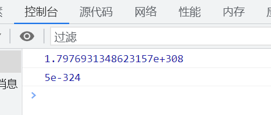


3. 数字型三个特殊值
```js
    <script>
    console.log(Infinity)   //Infinity
    console.log(-Infinity)  //-Infinity
    console.log(NaN)        // NaN
    </script>
```
- Infinity，代表无穷大，大于任何数值
- -Infinty, 代表无穷小，小于任何数值
- NaN,Not a number,代表一个非数值。

代码示例
```JS
    <script>
    console.log(Number.MAX_VALUE*2)
    console.log(-Number.MAX_VALUE*3)
    console.log("hello" - 100)
    </script>
```
运行结果
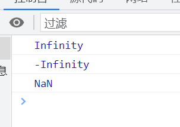

### 4.2.3 isNaN()
用来判断一个变量是否为非数字的类型，返回true或者false。

```JS
    <script>
    console.log(isNaN(123))  //false
    console.log(isNaN("dsfsdf"))  //true
    </script>
```

### 4.2.4 字符串型 String
1. JS可以用单引号嵌套双引号，或者用双引号嵌套单引号（外双内单，外单内双）


2. 类似HTML里面的特殊字符，字符串也有特殊字符，我们称之为转义符。
   转义符都是\开头的，常用的转义符及其说明如下：

| 转义符  |   解释说明    | 
|:----- |  :------------ |
| \n     |  换行符，n是newline的意思 | 
| \\     | 斜杠\                    |
| \'     |   '单引号   |
| \"     | " 双引号    | 
| \t     | tab缩进     |
| \b     | 空格，b是blank的意思  | 

3. 字符串长度
   字符串是由若干字符组成的，这些字符的数量就是字符串的长度。通过字符串的length属性可以获取整个字符串的长度。

```JS
    <script>
     var str = "hello world!"
     console.log(str.length)
    </script> //显示12，空格和符号都算字符。
```
4. 字符串的拼接
- 多个字符串之间可以用+进行拼接，其拼接方式为字符串 + 任何类型 = 拼接之后的新字符串。
- 拼接前会把与字符串相加的任何类型转化成字符串，再拼接成一个新的字符串。
- \+ 总结口号：数值相加，字符相连。
  
### 4.2.5 布尔值类型Boolean
布尔值类型有两个值：true和false，其中true表示真（对），而false表示假（错）
   
注意: 布尔值与数字相加时，true的值为1，false的值为0；

### 4.2.6 Undefined 和Null
一个声明后没有被赋值的变量，会有一个默认值undefind,可以与字符串相加，但是与数值型或布尔型相加时，会返回NaN值。

一个声明变量给null值，里面存的值为空。

## 5 获取变量数据类型
### 5.1 typeof
typeof可以用来获取检测变量的数据类型。

```js
    <script>
        var num = 20;
        // 值为number
        console.log(typeof(num));
    </script>
```
## 6. 数据类型转化
将一种数据类型转换成另外一种数据类型。
### 6.1 转成字符串
| 方式  | 说明  |  案例  |
| :---- | :----| :-----|
| toString() | 转化成字符串 | var num = 1; alert(num.toString()); |
| String() 强制转换 | 转成字符串 | var num = 1; alert(String(num));|
| 加号拼接字符串 | 和字符串拼接的结果都是字符串 | var num = 1 ;alter(num + "我是字符串") | 

### 6.2 转成数字型

| 方式  |   说明   | 案例   | 
| :---  | :------- | :------|
| parseInt(string)函数 | 将string类型转成整数数值型 | parselnt('78') | 
| parseFloat(string)函数 | 将string类型转化成浮点型数值 | parseFloat("68.21") |
| Number()强制转化函数 | 将string类型转化成数值型 | Number('12') |
| js 隐式转化（- * /） | 利用算数隐式转化数值型 | '21' - 0 |


### 6.3 转化成布尔型

| 方式  | 说明  | 案例  | 
| :---- | :----| :-----|
| Boolean()函数 | 其他类型转化成布尔值 |  Boolean('true') |

- 代表空，否定的值会被转化成false，如'',0,NaN,null,undefined;
- 其余值都会被转化成true;


# 5. 运算符
运算符也被称为操作符，是用于实现赋值，比较和执行算数运行等功能的符号。
javaScript中常见的运算符有：
- 算数运算符
- 递增和递减运算符
- 比较运算符
- 逻辑运算符
- 赋值运算符

## 5.1 算术运算符

| 运算符  |  描述   | 实例   | 
| :------| :-------| :------|
| +  | 加   | 10+20 = 30   |
| - | 减  | 10 - 20 = -10 | 
| * | 乘  | 10 * 20 = 200 | 
| / | 除  | 10/20 =0.5   |
| % | 取余数 | 9 % 2 = 1   |

注意:浮点数直接参与运算可能有误差,所以不要直接判断两个浮点数是否相等。
```js
    <script>
     console.log(0.1 + 0.2)
    </script>
    //值为: 0.30000000000000004
```

## 5.2 表达式和返回值
表达式： 是由数字、运算符、变量等以能求得数值的有意义排列方法排列方法所得的组合。   
简单理解： 是由数字、运算符、变量等组成的式子。
 a = 1 + 1
 例如： 1+1就是一个表达式，它将结果作为返回值赋给a.

 ## 5.3 递增和递减运算符概述
 如果需要反复给数字变量添加或减去1，可以使用递增（++）和递减（--）运算符来完成。     
 注意：递增和递减运算符必须配合变量使用。
 后置：先原值运算，然后自加（先人后己）
 前置：先自加，后运算  （先己后人）

 ## 5.4 比较运算符
 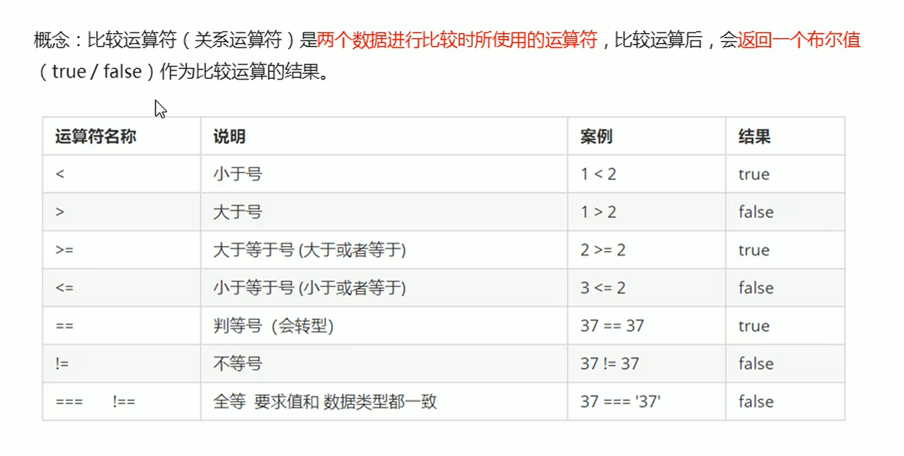

## 5.5 逻辑运算符
 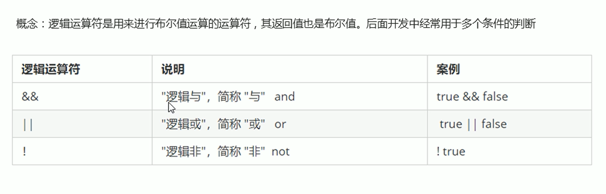
### 5.5.1 逻辑与
 值或者表达式参与逻辑运算。   
 短路运算的原理: 当有多个表达式（值）时，左边的表达式值可以确定结果时，就不再继续运算右边的表达式的值。
 
 - 表达式1 && 表达式2，
 - 如果表达式1结果为真，则返回表达式2  
 - 如果表达式1结果为假，则返回表达式1

### 5.5.2 逻辑或
- 语法： 表达式1 || 表达式2
- 如果第一个表达式1的值为真，则返回表达式1
- 如果第一个表达式1的值为假，则返回表达式2

```js
    <script>
     console.log( 123 || 456); //123
     console.log(0 || 456);   // 0
     console.log(123 || 4 || 6);//123
    </script>
```

## 5.6 赋值运算符
概念： 用来把数据赋值给变量的运算符
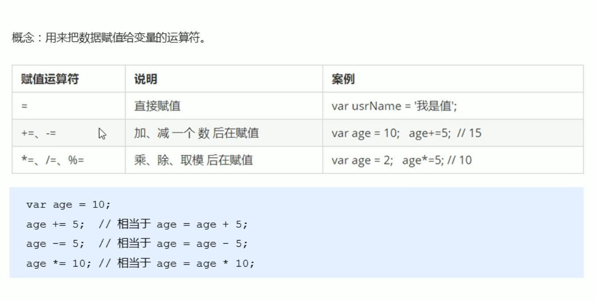

## 5.6 运算优先级
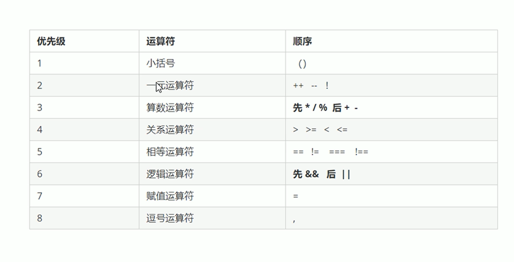


# 6. 流程控制
常见的三种结构，分别式顺序结构，分支结构和循环结构。
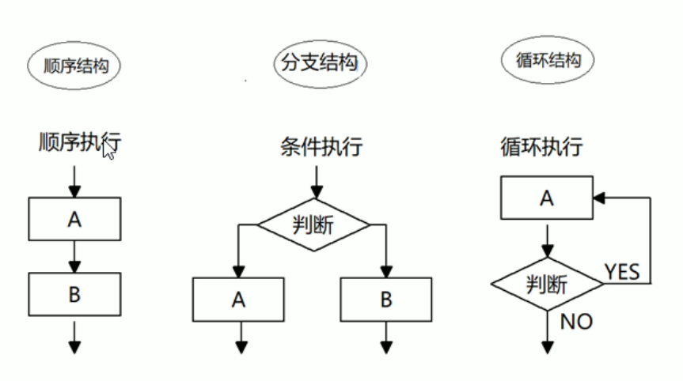


## 6.1 分支结构
由上而下执行代码的过程中，根据不同的条件，执行不同的路径代码（执行代码多选一的过程），从而得到不同的结果。    
JS语言提供了两种分支结构语句。
- if语句
- switch语句

### 6.1.1 if单支
1. 语法结构
```js
// 条件成立执行代码，否则什么也不做
if (条件表达式){
    //条件成立执行的代码语句。
}
```
代码示例
```JS
    <script>
     var age = prompt("请输入您的年龄：")
     if (age >= 18){
         alert("您可以进入网吧")
     }
    </script>
```

### 6.1.2 if else(双分支)
1. 语法结构
```JS
// 条件成立 执行if里面代码1，否则执行else里面的代码2
if (条件表达式){
    //  代码1
}else{
    // 代码2
}
```

代码示例
```JS
    <script>
     var age = prompt("请输入您的年龄：")
     if (age >= 18){
         alert("您可以进入网吧")
     }else{
         alert("小屁孩，快走！")
     }
    </script>
```

### 6.1.3 if else if（多分支）  
1. 语法结构
```js
//适合于检查多重条件
if (条件表达式1) {
    语句1;
}else if (条件表达式2) {
    语句2;
}else if (条件表达式3){
    语句3;
}else {
    //上述条件都不成立则执行此处代码。
}
```

### 6.1.4 三元表达式
1. 有三元运算符组成的式子，我们称为三元表达式。    
语句结构
```JS
条件表达式 ？ 表达式1 : 表达式2;
```
代码示例
```JS
//案例1
    <script>
     var age = prompt("请输入您的年龄：")
     age >= 18 ? alert("您可以进入网吧") : alert("小屁孩，快走！");
    </script>

//案例2
   <script>
     var num = prompt("请输入一个值：")
     num >= 10 ? alert(num.toString()) : alert("0"+num.toString());
    </script>
```

### 6.1.5 switch语句
switch语句也是多分支语句，它用于基于不同的条件来执行不同的代码。当要针对变量设置一系列的特定值的选项时，就可以使用switch.
```JS
switch( 表达式 ) {
    case value1:
        //表达式 等于value1时要执行的代码
        break;
    case value2:
        //表达式 等于value2时要执行的代码
        break;
    default: 
       // 表达式 不等于任何一个value时要执行的代码
}
```
注意：num的值和case里面的值必须一样（值和数据类型要一致）
```js
    <script>
    var num = prompt("请输入一个数字:");
    switch (num) {
        case '1':
            alert("你好");
        break;
        case '2':
            alert("hello");
        break;
        default: 
            alert("拜拜");
    }
    </script>
```

## 6.2 switch和if else if语句的区别
- 一般情况下，它们两个语句可以相互替换。
- switch...case语句通常处理case为比较确定值的情况，而if...else...语句更加灵活，常用于范围判断(大于、等于某个范围。)
- switch语句进行条件判断后直接执行到程序的条件语句，效率更高。而if...else语句有几种条件，就得判断多少次。
- 当分支比较少时，if...else语句的执行效率比switch语句高。
- 当分支比较多时，switch语句的执行效率比较高，而且结构更清晰。

# 7. JS循环
循环目的
- 在实际问题中，有许多具有规律性的重复操作，因此在程序中就需要重复执行某些语句。


## 7.1 for循环
在程序中，一组被重复执行的语句被称为循环体，能否继续重复执行，取决于循环的终止条件，由循环题及循环的终止条件组成的语句，被称之为循环语句。

- 语法结构
for循环主要用于把某些代码循环若干次，通常和计数有关系。
```JS
for(初始化变量; 条件表达式; 操作表达式){
    //循环体
}
```
- 初始化变量： 就是用var声明的一个普通变量，通常用于作为计数器使用。
- 条件表达式： 就是用来决定每一次循环是否继续执行，就是终止条件。
- 操作表达式：是每次循环最后执行的代码。经常用于我们计数器变量进行更新（递增或者递减）
  
```js
    <script>
        for(var i=1;i<=100;i++){
            console.log("你好");
        }
    </script>
```

## 7.2 断点调试
断点调试是指直接在程序的某一行设置一个断点，调试时，程序运行到这一行就会停住，然后可以一步一步往下调试，调试过程中可以看各个变量的当前值，出错的化，调试到出错的代码即显示错误，停下。    

\
断点调试可以帮我们观察程序的运行过程。   
1. 浏览器中按F12-->sources ---> 找出要调试的文件 ----> 在程序某一行设置断点。
2. Watch: 监视，通过watch可以监视变量的值变化。
3. F11: 程序单步执行，让程序一行一行的执行，这个时候，观察watch中变量的值的变化。
   
## 7.3 for循环重复执行不同代码
for循环可以重复执行不同的代码，因为我们有计数器变量i的存在，i每次循环值都会发生变化   
```JS
    <script>
        for(var i=1;i<=100;i++){
            if(i == 1){
                console.log("这个人已经1岁");
            }else if(i == 100){
                console.log("挂了");
            }else{
                console.log("这个人今年"+i+"岁")
            }
        }
    </script>
```

打印99乘法表
```js
    <script>
        for(var i=1;i<=9;i++){
           var str=""
            for(var j=1;j<=i;j++){
                str += j + "*" + i + "=" + i*j + "  "; 
            } 
            console.log(str)
        }
    </script>
```

## 7.4 while循环
while语句可以在条件表达式为真的前提下，循环执行指定的一段代码，直到表达式不为真时结束循环。
- 语法结构如下
```js
while(条件表达式){
    //循环体代码
}
```

执行思路：
1. 先执行条件表达式，如果结果为true,则执行循环体代码，如果为false，则退出循环，执行后面的代码。
2. 执行循环体代码
3. 循环题代码执行完毕和偶，程序会继续执行判断条件表达式，如果结果为true,则执行循环体代码，直到判断条件为false，则退出循环。

示例代码
```js
    <script>
      var num=1;
      while(num<=10){
          console.log("hello");
          num++;
      }  
    </script>
```

## 7.5 do while循环
do...while语句其实是while语句的一个变体。该循环会先执行一次代码块，然后对条件表达式进行判断，如果条件为真，就会重复执行循环体，否则退出循环。    
do...while语句的语法结构如下：   
```js
do {
    //循环代码-->条件表达式为true时重复执行循环代码
}
```
执行思路：
1. 先执行一次循环体代码
2. 再执行条件表达式，如果结果为true,则继续执行循环体代码，如果为false,则退出循环，继续执行后面代码

注意：先再执行循环体，再判断，我们会发现do...while循环语句**至少会执行一次循环体代码**

## 7.6 continue关键字
continue关键字用于立即跳出本次循环，继续下一次循环（本次循环体中continue之后的代码就会少执行一次。）
- 示例代码
```JS
    <script>
        for(var i=1;i<=5;i++){
            if(i== 3){
                continue;
            }
            console.log("我再吃第"+i+"个包子");
        }
    </script>
```


## 7.7 break关键字
break关键字用于立即跳出整个循环（循环结束）
例如：吃五个包子，吃到第三个包子就不吃了。
```js
    <script>
        for(var i=1;i<=5;i++){
            if(i== 3){
                break;
            }
            console.log("我再吃第"+i+"个包子");
        }
    </script>
```
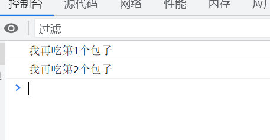

# 8. 数组的概念
数组是指一组数据的集合，其中的每个数据被称佐元素，在数组中可以存放任意类型的元素，数组是一种将一组数据存储在单个变量名下的方式。

```JS
//普通变量一次智能存储一个值
var num = 10;
// 数组一次可以存储多个值
var arr = [1,2,3,4,5];
```

## 8.1 创建数组
JS中创建数组有两种方式：
- 利用new创建数组
- 利用数组字面量创建数组

### 8.1.1 利用new创建数组
```js
var 数组名 = new Array();
var arr = new Array();
```

### 8.1.2 利用数组字面量创建数组
```JS
//1. 使用数组字面量方式创建空的数组。
var 数组名 = [];
//2. 使用数组字面量方式创建带初始值的数组
var  数组名 = ['小白','小黑'];
```

## 8.2 数组的索引
索引（下标）: 用来访问数组元素的序号（数组下标从0开始）   
var arr=['小白','小黑']   
索引号:   0      1     
数组可以通过索引来访问，设置，修改对应的数组元素，我们可以通过"数组名[索引]"的形式来获取数组中的元素。    

## 8.3 遍历数组
由于从数组中取出每一个元素时，代码是重复的，有所不一样的是索引值在递增，所以利用循环可以将数组的值取出来。    
其中***数组名.length***可以获取到数组长度。
```js
    <script>
        var  arr=[1,2,3,4,5,6]
        for(var i=0;i<arr.length;i++){
            console.log(arr[i])
        }
    </script>
```
## 8.4 数组新增元素
- 可以通过修改length长度来实现数组扩容目的
- length属性是可读写的。
- 也可以通过修改数组索引的方式追加数组元素。
- 但是注意不要给数组名直接赋值，否则会覆盖之前的数据
```js
    <script>
        var  arr=[1,2,3,4,5,6]
        arr[8]=8
        for(var i=0;i<arr.length;i++){
            console.log(arr[i])
        }
    </script>
```

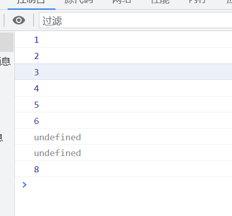


# 9. 函数概念
当代码需要大量重复使用时，就可以使用JS中的函数。    
函数在使用时分为2步：
- 声明函数
- 调用函数
## 9.1 声明函数
```js
//声明函数
function 函数名() {
    //函数体代码
}

```
- function是声明函数的关键字，必须小写。
- 由于函数一般是为了实现某个功能才定义的，所以通常我们将函数名命名为动词，例如getSum


## 9.2 调用函数
```JS
// 调用函数
函数名();
//通过调用函数名来执行函数体代码。
```
- 调用的时候千万不要忘记添加小括号
- 口诀：函数不调用，自己不执行
  
注意：声明函数本身并不会执行代码，只有调用函数时才会执行函数体代码。

## 9.3 函数的封装
- 函数的封装时把一个或者多个功能通过函数的方式封装起来，对外值提供一个简单的函数接口。
- 简单理解：封装类似于将电脑配件整合组装到机箱中（类似快递打包）


## 9.4 函数的形参和实参
在声明函数时，可以在函数名称后面的小括号中添加一些参数，这些参数被称为形参，而在调用该函数时，同样也需要传递相应的参数，这些参数被称为实参。    

| 参数  |  说明 | 
|:----|:------|
| 形参 | 形式上的参数 函数定义的时候 当前并不知道是什么 | 
| 实参 | 实际上的参数 函数调用的时候 实参是传递给形参的 | 


## 9.5 return语句
有时候，我们会希望函数将值返回给调用者，此时通过使用return语句就可以实现。

语法格式
```js
function 函数名() {
    return  需要返回的结果;
}

函数名(); //调用函数
```

(1) 我们函数只是实现某种功能，最终的结果返回给函数的调用者函数名() 通过return 实现。
(2)只要函数遇到return 就把后面的结果 返回给函数的调用者 函数名()  = return后面的结果。

注意： 
- return只能返回一个值，如果用逗号隔开多个值，以最后一个为准，但是多个值可以用数组返回。

- 我们的函数如果有return 则返回return的值，如果函数没有return 则返回undefined。


## 9.6 arguments的使用
当我们不确定有多少个参数传递时候，可以用arguments来获取。在JavaScript中，arguments实际上它是当前函数的一个内置对象。所有函数都内置了一个arguments对象，argeuments对象中存储了传递的所有实参。    

\
arguments展示形式是一个伪数组，因此可以进行遍历。伪数组具有以下特点：
- 具有length属性
- 按索引方式存储数据。
- 不具有数组的push,pop方法

```js
        function getNumMax() {
           var arr = [];
            for(var i = 0;i<arguments.length;i++){        
                arr[arr.length]= arguments[i]
        }
         return arr
    }
        alert(getNumMax(1,12,8,4,5,6,"hello",[1,3]));
```

运行结果
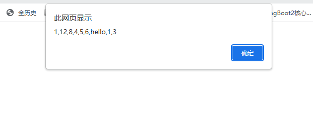


## 9.7 函数可以调用另外一个函数
因为每个函数都是独立的代码块，用于完成特殊任务，因此经常会用到函数相互调用的情况。
```JS
    <script>
        function fun1() {
            console.log(11);
            fun2()
     
        }
        function fun2() {
            console.log(12);
     
        }
        fun1();
    </script>
```

## 9.10 函数的2种声明方式
1. 利用函数关键字自定义函数（命名函数）
```js
function fn() {

}
fun();
```

2. 函数表达式
```js
var 变量名 = function(){};
var fun = function(aru) {
    console.log('我是函数表达式');  
    console.log(aru) 
}
fun();
```
- fun是变量名，不是函数名
- 函数表达式声明方式跟声明变量差不多，只不过变量里面存的是值，而函数表达式里面存的是函数。
- 函数表达式也可以进行传递参数

```js
    <script>
        var fun = function() {console.log('17')}
        fun()
    </script>
```

# 10. 作用域
通常来说，一段程序代码种所用的名字并不总是有效和可用的，而限定这个名字的可用性的代码范围就是这个名字的作用域，作用域的使用提高了程序逻辑的局部性，增强了程序的可靠性，减少了名字冲突。     
根据作用域的范围不同，可以分为2种变量
- 全局变量：在全局作用域下的变量，在全局下使用。（函数外部定义的变量）
- 局部变量：在局部作用域下的变量，例如在函数内部的变量（函数内部定义的变量）    

全局变量和局部变量的区别
- 全局变量：在任何一个地方都可以使用，只有在浏览器关闭时才会被销毁，因此比较占内存。
- 局部变量：只有函数内部使用，当其所在的代码块被执行时，会被初始化；当代码块运行结束后，就会被销毁，因此更节省内存空间。

注意： **如果声明变量时，没有使用var,即a=9,那么默认a为全局变量！**


作用域链
- 只要是代码，就至少有一个作用域。
- 写在函数内部的局部作用域
- 如果函数中还有函数，那么在这个作用域中就可以诞生一个作用域。
- 根据在内部可以访问外部函数变量的这种机制，用链式查找决定哪些数据能被函数内部访问，就称作作用域链。

注意: es6支持块级作用域，而之前版本不支持。

# 11. 预解析
JavaScript代码是由浏览器中的JavaScript解析器来执行的，JavaScript解析器在运行JavaScript代码的时候分为两步：预解析和代码执行。     
步骤如下：
- 预解析JS引擎会把js里面所有的var 还有function提升到当前作用域的最前面。
- 代码执行，安装代码书写顺序从上往下执行。

注意：
1. 预解析分为 变量预解析（变量替身）和 函数预解析（函数提升）
2. 变量提升 就是把所有的变量声明提升到当前的作用域最前面  不提升赋值操作。
3. 函数提升 就是把所有函数声明提升到当前作用域的最前面  不调用函数。

示例
```js
f1();
console.log(c);
console.log(b);
console.log(a);

function f1() {
    var a = b = c = 9;
    // 此处等价 var a=9; b=9 ;c=9（b,c为全局变量）
    console.log(a);
    console.log(b);
    console.log(c);
}

//预解析效果如下
function f1() 


function f1() {
    var a;
     a = b = c = 9；
    console.log(a);  //9 
    console.log(b);  //9
    console.log(c);  //9
}
f1();
console.log(c);   //9
console.log(b);   //9
console.log(a);  //报错
```

# 12. 对象
什么是对象
- 现实中：对象是一个具体的事物，万物皆可对象。
- js中：对象是一组无序的相关属性和方法的集合，所有的事物都是对象，例如:字符串，数值，数组和函数等。    

对象是由属性和方法组成的
- 属性: 事物的特征，在对象中用属性来表示(常用名词)
- 方法：事物的行为，在对象中用方法来表示(常用动词)

## 12.1 创建对象的三种方式
在javaScript中，现阶段我们可以采用三种方式创建对象（object):
- 利用字面量创建对象
- 利用new Object创建对象
- 利用构造函数创建对象

### 12.1.1 利用字面量创建对象
对象字面量: 就是花括号{}里面包含了表达这个具体事物（对象）的属性和方法。
1. 里面的属性或者方法我们采用键值对的形式,键(属性名) : 值(属性值,属性值可以是任意类型的值。)
2. 多个属性或者方法中间用逗号隔开

使用对象
1. 调用对象的属性，我们采取:对象名.属性名
2. 调用属性还有另外一种方法: 对象名['属性名']

```js
    <script>
        dog = {
            name: "可可",
            type: "阿拉斯加犬",
            age: 5,
            color: "棕红色",
            skills: ['bark','showFilm']
        }

        console.log(dog.skills[0])
    </script>
```

### 12.1.2 变量，属性，函数，方法总结
- 变量：单独声明赋值，单独存储
- 属性：对象里面的变量称为属性，不需要声明，用来描述该对象的特征。
- 函数：单独存在的，通过"函数名()"的方式就可以调用。
- 方法：对象里面的函数称为方法，方法不需要声明，使用"对象.方法名()"的方式就可以调用，方法用来描述该对象的行为和功能。

### 12.1.3 利用new Object创建对象。
利用new Object创建对象
语法参考如下：
```JS
    <script>
        var obj = new Object();
        obj.name = "张三锋";
        obj.age = 18;
        obj.sex = "男";
        obj.sayHi = function(){
            console.log('hi~')
        }
        
        console.log(obj.name);
        obj.sayHi()

    </script>
```

### 12.1.4 利用构造函数创建对象
构造函数：是一种特殊的函数，主要用来初始化对象，即为对象成员变量赋值初始值，它总与new运算符一起使用。我们可以把对象中一些公共的属性的方法抽取出来，然后封装到这个函数里面

- 构造函数名字需要大写。
- 构造函数不需要return 就可以返回结果
- 我们调用构造函数，必须使用new
```JS
    <script>
        function Star(name,age) {
            this.name = name;
            this.age = age;
        }

        var ldh = new Star("张三",17);
        console.log(ldh.age);
    </script>
```

## 12.2 构造函数和对象
- 构造函数，如Star(),抽象了对象的公共部分，封装到了函数里面，它泛指某一大类（class)
- 创建对象，如new Stars(),特指某一个，通过new关键字创建对象的过程我们也称为对象实例化。

### 12.2.1 new关键字
new在执行时会做四件事
1. 在内存中创建一个新的对象
2. 让this指向这个新的对象
3. 执行构造函数里面的代码，给这个新对象添加属性的方法
4. 返回这个新对象（所以构造函数里面不需要return)

### 12.2.2 遍历对象属性
for ... in 语句可以对数组或者对象的属性进行循环操作。
```js
    <script>
        var  ldh= {
            name: "张三",
            age: 12,
            sex: "男"
        }
     
        for(var i in ldh) {
            console.log(i)  //属性名
            console.log(ldh[i]) // 属性值
        }
    </script>
```

# 13.内置对象
- JavaScript中的对象分为三种：自定义对象，内置对象，浏览器对象
- 前面两种对象时JS基础内容，属于ECMAScript; 第三个浏览器对象属性
- 内置对象就是指JS语言自带的一些对象，这些对象供开发者使用，并提供了一些常用的或者最基本而必要的功能（属性和方法）
- 内置对象最大的优点就是帮助我们快速开发。
- JavaScript提供了多个内置对象：Math, Date, Array, String等。

## 13.1 MDN
[MDN网址](https://developer.mozilla.org/zh-CN) 
学习步骤
1. 查阅该方法的功能
2. 查看里面参数的有意义和类型
3. 查看返回值的意义和类型
4. 通过demo进行测试
常见对象
- Math  数字相关
- Date  日期相关
- Array 数组相关   

# 14. 简单类型与复杂类型
简单类型又叫做基本数据类型或值类型，复杂类型又叫做引用类型。
- 值类型：简单数据类型/基本数据类型，在存储变量中存储的是值本身，因此叫做值类型；string,number,boolean,undefined,null(返回是空对象object)
- 引用类型：复杂数据类型，在存储时变量中存储的仅仅时地址（引用）,因此叫做引用数据类型。通过new关键字创建的对象（系统对象，自定义对象）,如Object,Array,Date等。

## 14.1 堆和栈
堆栈空间分配区别：
1. 栈（操作系统）：由操作系统自动分配释放存放函数的参数值，局部变量的值等，其操作方式类似于数据结构中的栈。
简单数据类型存放到栈里面
2. 堆（操作系统）：存储复杂类型（对象），一般由程序员分配释放，若程序员不释放，由垃圾回收机制回收。复杂数据类型放在堆里面
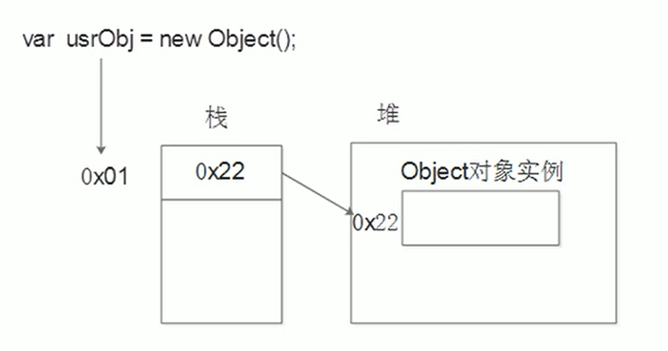

## 14.2 简单类型传参
函数的形参也可以看做是一个变量，当我们把一个值类型变量作为参数传给函数的形参时，其实是把变量在栈空间里的值复制了一份给形参，那么在方法内部对形参做任何修改，都不会影响到外部变量。

## 14.3 复杂类型传参
函数的形参也可以看作是一个变量，当我们把应用类型变量给形参是，其实是把变量在栈空间里保存的堆地址复制给了形参，形参和实参其实保存的是同一个堆地址，所以操作的是同一个对象。

# 15. API和Web API
1. API是为程序员提供的一个接口，帮助我们实现某种功能，我们会使用就可以了，不必纠结内部如何实现。
2. Web API主要是针对于浏览器提供的接口，主要针对于浏览器做交互效果
3. Web API一般都有输入和输出（函数的传参和返回值）,Web API很多都是方法（函数）
4. 学习Web API可以结合前面学习内置对象方法的思路学习。
   
# 16.DOM
## 16.1 DOM简介
文档对象模型(Document Object Model,简称DOM),是W3C组织推荐的处理可扩展标记语言（HTML或者XML）标准程序接口。
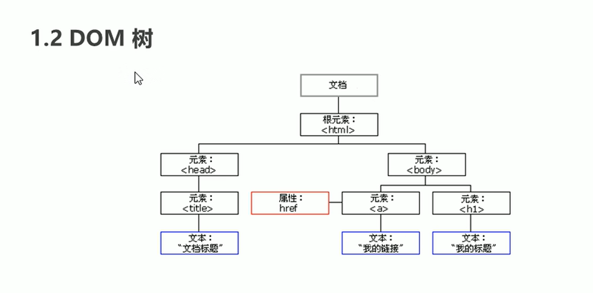

- 文档：一个页面就是一个文档，DOM中使用document表示
- 元素：页面中的所有标签都是元素，DOM中使用element表示
- 节点：网页中所有的内容都是节点（标签，属性，文本，注释等），DOM中使用node表示。
- DOM把以上内容都看做是对象。

# 16.2 获取元素
获取元素的方法
- 根据ID获取
- 根据标签名获取
- 通过HTML5新增的方法获取
- 特殊元素获取
## 16.2.1 根据ID获取
使用getElementByID()方法可以获取带有ID的元素对象。
1. 因为我们文档页面从上往下加载，所以先得有标签 所以我们script写到标签的下面。
2. get获取element元素by通过 驼峰命名法
3. 参数id是大小写敏感的字符串
4. 返回的是一个元素对象
5. cosole.dir打印我们返回元素对象，更好的查看里面的属性和方法。

```js
<body>
    <div id="time">2019-9-9</div>
    <script>
     var time = document.getElementById("time");
     console.dir(time);
    </script>
</body>
```

### 16.2.2 根据标签名获取
使用getElementByTagName()方法可以返回带有指定标签名的对象的集合。
- 还有可以获取某个元素（父元素）内部所有指定标签名的子元素
- 注意：父元素必须是单个对象（必须指明是哪一个元素的对象），获取时不包括父元素自己
```js
    <style>
        li {
           list-style-type : none;
        }
    </style>

</head>
<body>
    <div>
        <ul>
            <li>咸鱼突刺</li>
            <li>咸鱼突刺</li>
            <li>咸鱼突刺</li>
            <li>咸鱼突刺</li>
            <li>咸鱼突刺</li>
        </ul>
    </div>
    <script>
        var lis = document.getElementsByTagName('li')
       console.dir(lis[0].innerText);
       for (var i = 0;i<lis.length;i++){
           console.log(lis[i].innerText)
       }
    </script>
</body>
```

示例2
```JS
    <style>
        li {
           list-style-type : none;
        }
    </style>

</head>
<body>
    <div>
        <ul id="fish_hit">
            <li>咸鱼突刺</li>
            <li>咸鱼突刺</li>
            <li>咸鱼突刺</li>
            <li>咸鱼突刺</li>
            <li>咸鱼突刺</li>
        </ul>
    </div>
    <script>
       var fish_hit = document.getElementById('fish_hit')
       var fish_hit_li = fish_hit.getElementsByTagName('li')
       console.log(fish_hit_li[0].innerText)
    </script>
```

### 16.2.3 H5新增获取元素方法
//根据类名返回元素对象集合
1. document.getElementsByClassName('类名'); 

//根据指定选择器返回第一个元素对象   
2. document.querySelector('选择器'); 

//根据指定选择器返回
3. document.querySelectorAll('选择器');

```js
<head>
    <meta charset="UTF-8">
    <meta http-equiv="X-UA-Compatible" content="IE=edge">
    <meta name="viewport" content="width=device-width, initial-scale=1.0">
    <title>test</title>
    <style>
        li {
           list-style-type : none;
        }
    </style>

</head>
<body>
   <div class="box">盒子1</div>
   <div class="box">盒子2</div>

   <div id="nav">
       <ul>
           <li>首页</li>
           <li>产品</li>
       </ul>
   </div>
   <script>
       var boxs = document.getElementsByClassName('box')
       console.log(boxs[0])

       var boxsFirst = document.querySelector('.box')
       console.log(boxsFirst)

       var nav = document.querySelector('#nav')
       console.log(nav)

       var li = document.querySelector('li')
       console.log(li)

       var allBox = document.querySelectorAll('.box')
       console.log(allBox)
   </script>
</body>
</html>
```
运行结果
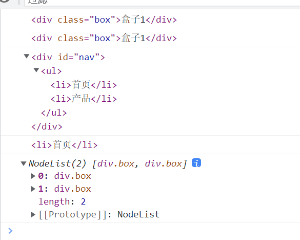

### 16.2.4 获取特殊元素(body,html)
获取body元素
1. document.body //返回body元素对象

获取html元素
2. document.documentElement //返回html元素对象


## 16.3 事件基础
### 16.3.1 事件概述
JavaScript使我们有能力创建动态页面，而事件是可以被JavaScript侦测到的行为。    
简单理解： 触发 ---- 响应机制。    
网页中的每个元素都可以产生某些可以触发JavaScript的事件，例如：我们可以在用户点击某按钮时产生一个事件，然后去执行某些操作

```js
<body>
    <button id="btn">唐伯虎</button>

   <script>
       //点击一个按钮，弹出对话框
       //1. 事件是由三部分组成  事件源  事件类型  事件处理程序
       //(1)事件源：事件触发的对象
       //(2)事件类型：如何触发，什么事件触发
       //(3)事件处理程序：通过一个函数赋值的方式完成
       var btn = document.getElementById('btn');
       btn.onclick= function(){
           alert("点秋香");
       }
   </script>
```

```js
<body>
    <button id="btn">输出被选中的学号</button>

   <script>
       function getRandomNum(max){
           return Math.floor(Math.random() * max)
       }
       // 获取事件源
       var btn = document.getElementById('btn')
       // 绑定事件 btn.onclick
       // 添加事件处理程序。
       btn.onclick = function getNum() {
           alert('请学号'+ getRandomNum(40)+'号'+'回答问题');
       }
   </script>
</body>
```

### 16.3.2 执行事件的步骤
1. 获取事件源
2. 注册事件（绑定事件）
3. 添加事件处理程序（采取函数赋值形式）
   
常见的鼠标事件   
| 鼠标事件   | 触发事件  |
| :-------  | :------   |
| onclikc   | 鼠标点击左键触发 |
| onmouseover | 鼠标经过触发   |
| onmouseout  | 鼠标离开触发   |
| onfocus     | 获得鼠标焦点触发 |
| onblur      | 失去鼠标焦点触发 |
| onmousemove | 鼠标移动触发   |
| onmouseup   | 鼠标弹起触发   | 
| onmousedown | 鼠标按下触发   | 


## 16.4 操作元素
JavaScript的DOM操作可以改变网页内容，结构和样式，我们可以利用DOM操作元素来改变元素里面的内容，属性等。注意以下都是属性

### 16.4.1 改变元素内容
```js
// 从起始位置到起止位置的内容，但它去除html标签，同时空格和换行也会去掉。
element.innerText

// 起止位置到终止位置的全局内容，包括html标签，同时保留空格和换行
element.innerHTML
``` 

### 16.4.2 改变元素属性的常用操作
- innerText、innerHTML改变元素内容
- src、href
- id、alt、title
  
```js
    <style>
        #showpct img{
            height: 300px;
            margin-top: 10px;
        }

        button {
            margin: 10px 10px;
        }
    </style>

</head>
<body>
    <button id="btn1">查看图片1</button>
    <button id="btn2">查看图片2</button>
    <div id="showpct"> 
        
    </div>
   
     <script>
         // 获取元素btn1
         var btn1 = document.getElementById('btn1');
         var btn2 = document.getElementById('btn2');
         var img = document.querySelector("img")
         // 绑定事件
         btn1.onclick = function setPicture() {
             img.src = "images/DSC01452.jpg"
         }
         // 绑定事件
        btn2.onclick = function setPicture() {
             img.src = "images/DSC01470.jpg"
         }
    </script> 
```

### 16.4.3 分时问候案例
```js
    <!-- 根据不同时间，页面显示不同的图片，同时显示不同的问候语。
         如果上午时间打开页面，显示上午好，显示上午的图片
         如果下午时间打开页面，显示下午好，显示下午的图片
         如果网上时间打开页面，显示晚上好，显示晚上的图片 -->
    <style>
        .text {
            margin: 10px 0px;
            text-align: center;
        }
        .ptc {
            position:relative;
        }

        /* 控制图片高度为300px */
        .ptc img {
            position: absolute;
            left: 50%;
            margin-left: -100px;
            height: 300px;
            
        }

    </style>

</head>
<body>
    <!-- 显示的部分 -->
    <div class="daytime">
        <div class="text">问候语</div>
        <div class="ptc">
            
        </div>
    </div>

    
    <script>
        // 获取元素 
        var text = document.querySelector(".text")
        var ptc = document.querySelector('img')

        //创建函数传入问候语和图片地址
        function chageTextPtc(newText,newPtc) {
            text.innerHTML=newText;
            ptc.src = newPtc;
        }

        //根据当前系统时间判断
       
            var datetime = new Date();
           
         if (6<datetime.getHours() && datetime.getHours()<12){
             let greetings = '上午好';
             let ptcPath= 'images/1.jpg';
             chageTextPtc(greetings,ptcPath)
         }else if(12<=datetime.getHours() && datetime.getHours()<19){
             let greetings = '下午好';
             let ptcPath= 'images/2.jpg';
             chageTextPtc(greetings,ptcPath)
         }else{
             let greetings = '晚上好';
             let ptcPath = 'images/3.jpg';
             chageTextPtc(greetings,ptcPath)
         }
    </script>
```

### 16.4.4 表单元素的属性操作
利用DOM可以操作如下表单元素的属性：
- type、value、checked、selected、disabled
```js
<body>
    <button>按钮</button>
    <input type="text" value="输入内容">
    <script>
        //获取元素
        var btn = document.querySelector('button')
        var input = document.querySelector('input')

        //绑定事件
        btn.onclick = function chageInputValue() {
            input.value = "爬爬爬";
            btn.disabled = true;
        }
    </script>
</body>
```

是否显示密码
```html
    <style>
        .box{
            position: relative;
            width: 300px;
            border-bottom: 1px solid #ccc;
            margin: 100px auto;
        }

        .box input {
            width:170px;
            height: 30px;
            border: 0;
            outline: none;
        }

        .box img{
            position: absolute;
            top: 2px;
            right: 2px;
            width: 24px;
        }
    </style>
</head>

<body>
    <div class="box">
        <label for="">
            
        </label>
        <input type="password" name="" id="">
    </div>

    <script>
        //获取元素
        var img = document.querySelector('img');
        var input = document.querySelector('input');
        //如果flag=1,那么不显示密码，
        var flag = 1;
        //绑定事件
            img.onclick = function changePass() {
                if (flag == 1){
                img.src = "images/open.png";
                input.type = "text";
                flag = 0
                }else{
                img.src = "images/close.png";
                input.type = "password";
                flag = 1
                }
            }
    </script>
```


### 16.4.5 样式属性操作
我们可以通过JS修改元素的大小，颜色，位置等样式
```JS
element.style //行内样式操作
element.className //类名样式操作
```
注意：
1. js里面的样式采取驼峰命名法，比如fontSize,backgroudColor
2. JS修改style样式操作，产生的时行内样式，css权重比较高。

